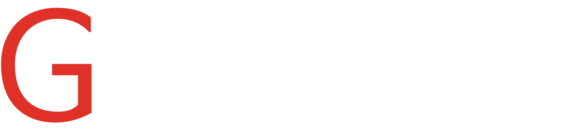

# GIST 청원 사이트

<div align="center">

</div>
<br/>


```
지스트 청원은 학교의 공식적인 인증을 받은 사이트이며  
[지스트 소통마당 지톡지톡](https://www.gist.ac.kr/site/gtalk/index.html)에서도 확인하실 수 있습니다.
```

## 😀 프론트 엔드 팀원 소개

|                                                        |                                                           |                                                               |                                                          |
| :----------------------------------------------------: | :-------------------------------------------------------: | :-----------------------------------------------------------: | :------------------------------------------------------: |
|  |  |  |  |
|          [김건호](https://github.com/gpgun0)           |          [김정윤](https://github.com/kimjngyun)           |          [이지민](https://github.com/leejimin-gist)           |          [최영준](https://github.com/choi2021)           |

<br/>

## 📲 기술 스택

<div align="center">
  <br>
  
  
<br>
